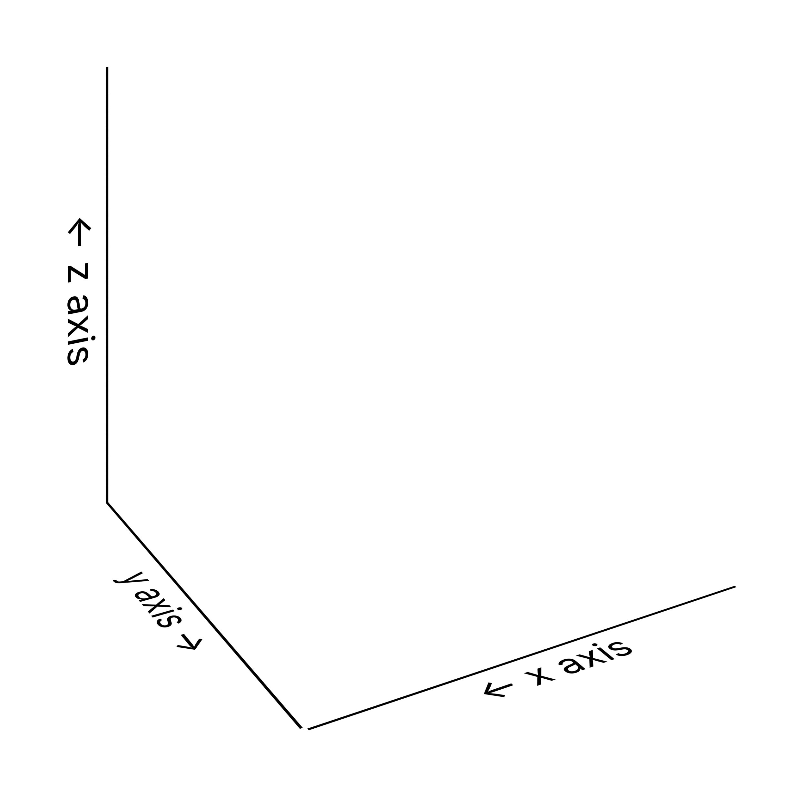

Concepts & Conventions
======================

Before building your first scene, it helps to know the handful of conventions
PoreScene assumes throughout. Following them keeps scripts reuseable and -- just
as importantly -- keeps the rendered geometries *physically on scale*: the whole scene traces back to a real, SI-based dimension.

Coordinate system and axis orientation
--------------------------------------

PoreScene renders with Blender's *Cycles* engine and therefore inherits Blender's
right-handed, Z-up coordinate system: ``x`` and ``y`` span the horizontal
plane and ``z`` points up. The calibrated axes drawn by
:meth:`Scene.create_axes() <porescene.scene.Scene.create_axes>` follow the same handedness, with ticks
increasing from the domain origin along each direction.

   PoreScene's right-handed, Z-up coordinate system. The calibrated ``x``, ``y``,
   and ``z`` axes originate at the domain corner and carry the physical scale in
   the configured display unit, while ``z`` points up.

If the default viewing angle does not suit your sample, the camera can be rotated
around the scene: :meth:`Scene.rotate_azimuth() <porescene.scene.Scene.rotate_azimuth>` orbits the camera
(and the lights) around the vertical ``z`` axis by a given azimuth angle in
degrees, keeping it aimed at the scene center.

Units
-----

Internal units
^^^^^^^^^^^^^^

PoreScene stores **all physical quantities in SI base units**, which is especially
important for lengths that are therefore always given in **meters**. This holds rigorously true in
all parts of the package, which ensures that generated visualizations are always on scale:

- the domain dimensions passed to :meth:`Scene.from_json() <porescene.scene.Scene.from_json>`,
- pore and throat radii (:attr:`PoreNetwork.pore_radius <porescene.model.PoreNetwork.pore_radius>`,
  :attr:`PoreNetwork.throat_radius <porescene.model.PoreNetwork.throat_radius>`),
- pore positions and every coordinate imported from a ``.mat`` file.

Keeping the internal representation in meters makes the numbers you pass
unambiguous regardless of the length scale of your sample -- from nanometer-scale
membranes to millimeter-scale packings.

Display units
^^^^^^^^^^^^^

While the internal *storage* is in meters, the units *shown on the axes* are
configurable. The :doc:`PoreScene configuration <config>` ``porescene.json`` accepts a ``unit_display``
key that converts axis ticks into the desired length scale. It defaults to ``"MICRO"``
(micrometers, ``µm``), which suits most tomographic samples. PoreScene understands the
full metric range, from ``QUETTA`` (10\ :sup:`30`)
down to ``QUECTO`` (10\ :sup:`-30`), so the same data can be labeled in ``nm``, ``µm``, ``mm``, etc., without touching the geometry. Internally the tick values are converted
from meters to the chosen display unit by a scale factor.

As example, in case the axis needs to be shown in millimeters, the ``porescene.json`` can be adjusted accordingly:

.. code-block:: json
   :caption: porescene.json

   {
      "axes": {
         "unit_display": "MILLI"
      }
   }

Scene scale vs. physical scale
^^^^^^^^^^^^^^^^^^^^^^^^^^^^^^

The geometry is normalized into a fixed bounding box for rendering: the longest
domain edge is mapped onto a bounding box of constant size, and the remaining edges
are scaled by the same factor so the aspect ratio is preserved. As a result,
Blender scene units are *not* meters -- the physical scale lives on the calibrated
axes, which are annotated in the chosen display unit. This decoupling makes that
samples of very different absolute size render into comparable, publication-ready
figures.

Scene components
----------------

PoreScene is **modular**: a scene is composed from independent components rather
than produced in one monolithic step. Creating a :class:`Scene <porescene.scene.Scene>`
-- either empty or from a configuration with
:meth:`Scene.from_json() <porescene.scene.Scene.from_json>` -- sets up only the
camera and lighting. Every visible element is then added explicitly, so you build
exactly the figure you need and nothing that you do not.

Once the scene exists, elements are added through dedicated ``create_*`` methods:

- :meth:`Scene.create_spheres() <porescene.scene.Scene.create_spheres>` -- a sphere
  for each pore (the *ball* of the stick-and-ball representation).
- :meth:`Scene.create_cylinders() <porescene.scene.Scene.create_cylinders>` -- a
  cylinder for each throat (the *stick*).
- :meth:`Scene.create_clusters() <porescene.scene.Scene.create_clusters>` -- watershed
  pore clusters loaded from a file.
- :meth:`Scene.create_cells() <porescene.scene.Scene.create_cells>` -- Voronoi cells
  of a volume tessellation.
- :meth:`Scene.create_solid() <porescene.scene.Scene.create_solid>` -- the solid
  microstructure, e.g. from tomographic imaging.
- :meth:`Scene.create_void() <porescene.scene.Scene.create_void>` -- the void space
  as a single 3D object.
- :meth:`Scene.create_axes() <porescene.scene.Scene.create_axes>` -- calibrated,
  on-scale axes with ticks and labels.

A pore network in stick-and-ball form with axes is therefore assembled
from a few explicit calls (note that coloring etc. needs additional steps):

.. code-block:: python

   from pathlib import Path

   from porescene.model import PoreNetwork
   from porescene.scene import Scene

   pth_data = Path.cwd()

   pn = PoreNetwork.from_mat(pth_data / "pnm.mat")
   sc = Scene.from_json(pn.extent, pth_data / "porescene.json")

   sc.create_axes()
   sc.create_spheres(pn.pore_position, pn.pore_radius)
   sc.create_cylinders(pn.throat_position, pn.throat_radius)
   sc.render(pth_data / "network.png")

Because scene elements are added independently, the same scene can freely combine
representations -- for example wrapping the stick and ball representation with the
solid -- and only the elements you add are present in the final render.

.. note::

   The higher-level workers in :mod:`porescene.worker` build on exactly these
   methods: they assemble the required geometry (such as throat end points) and
   then call the matching ``create_*`` methods for you.
