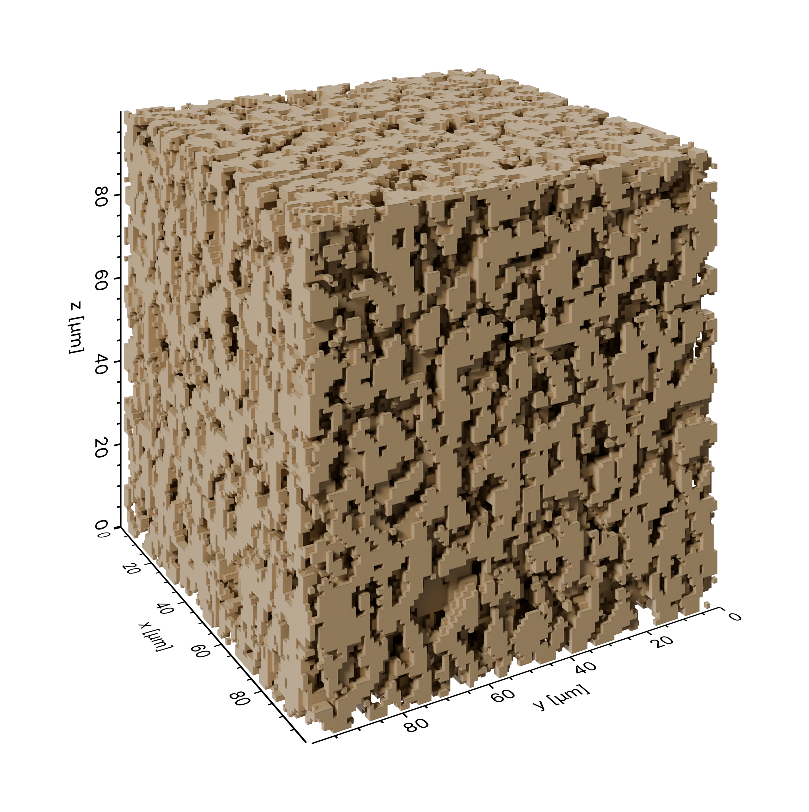

Solid Structure
===============

Renders a solid pore structure loaded from an OBJ mesh, together with a camera, lighting, and axes.

.. literalinclude:: ../../../example/solid.py
   :language: python
   :caption: example/solid.py
   :linenos:
