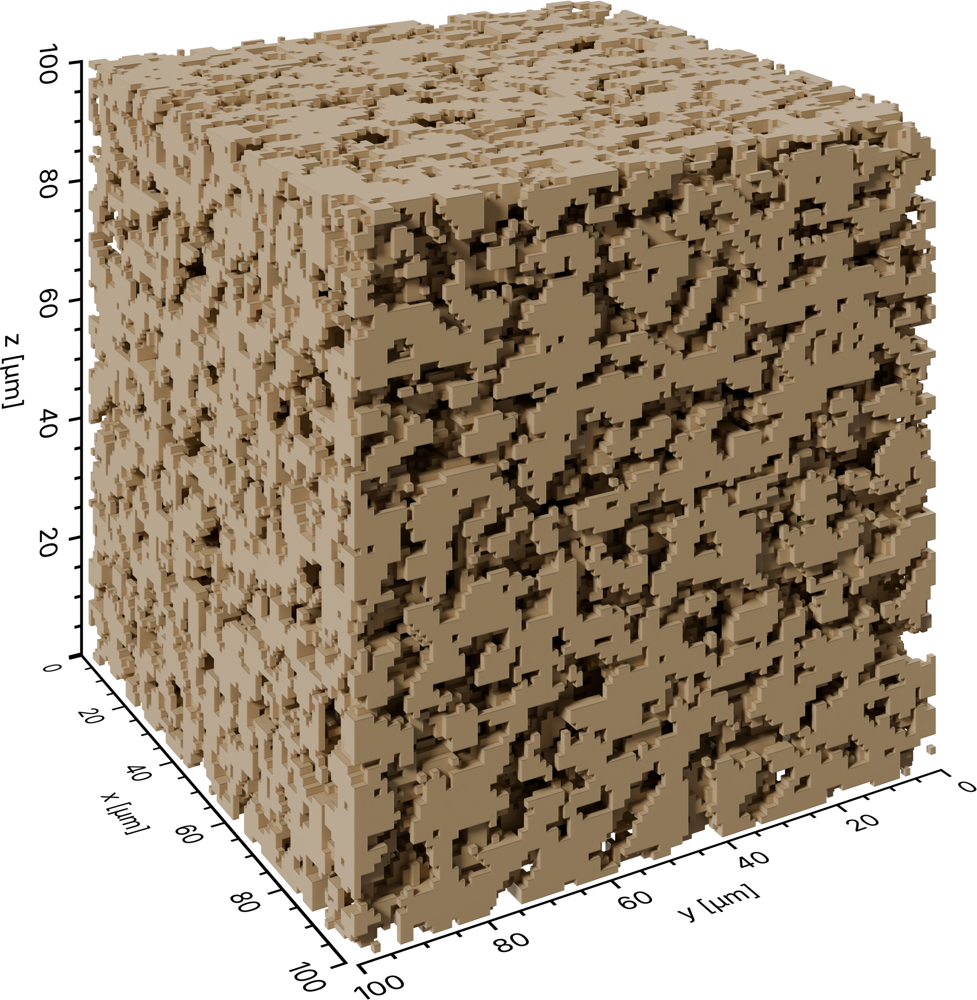

Structure of porous solids
==========================

The easiest visualization that can be created with PoreScene is a representation of the
3D structure of a porous material (no matter if it is on nano-, micro- or centimeter
length scale). The data used for this type of visualization is usually tomographic data,
which is often available as a binarized 3D voxel image.

To create a visualization of the material, this example shows how to generate a mesh of
the voxel data, load it into the scene, and render it to a PNG with a transparent
background.

As an example, this tutorial uses a binarized volume of a freeze-dried sugar solution that
was captured with X-ray micro-computed tomographic imaging
:footcite:p:`2025_faber_Porescale`, which is available in PoreScene's repository on
GitHub: `data/img_bin.raw <https://github.com/fefafe/porescene/tree/main/data>`_

   The rendered result: the solid phase of a freeze-dried sugar solution,
   captured with X-ray micro-computed tomography.

Step-by-step guide
------------------

1. Import required modules
^^^^^^^^^^^^^^^^^^^^^^^^^^

Make sure to have ``porescene`` installed (see :doc:`../installation`). At first, required modules need to be imported:

.. code-block:: python

   from pathlib import Path

   import numpy as np

   from porescene import io, utility
   from porescene.scene import Scene

Module :mod:`~porescene.utility` provides a function that converts the binarized
volume image into a mesh, which can be subsequently saved with functions from
:mod:`~porescene.io` in OBJ or PLY formats. :class:`Scene <porescene.scene.Scene>`
loads and renders the created mesh. File paths and directories are handled throughout
PoreScene with the built-in :mod:`pathlib` module.

2. Set utility variables
^^^^^^^^^^^^^^^^^^^^^^^^

After that, a directory for saving the mesh file and the rendered images is specified:

.. code-block:: python

   # data subdirectory
   pth_data = Path.cwd() / "data"

Next, some required information about the volume image is saved:

.. code-block:: python

   # [m] edge length of a single voxel
   L_vxl = 1e-6

   # [vxl] image resolution
   res_img = np.array((100, 100, 100))

   # [m] domain dimensions
   extent = res_img * L_vxl

``extent`` is the physical extent of the volume in **meters** -- here 100 voxels of
1 µm along each edge. It calibrates the axis ticks and sets the aspect ratio of the
scene, so it always stays in meters regardless of the unit you display (see
:doc:`../concepts`).

3. Mesh the binarized volume
^^^^^^^^^^^^^^^^^^^^^^^^^^^^

The binarized volume data is loaded from file and reshaped into its original
resolution. :func:`~porescene.utility.volume2mesh` turns the binarized volume into a
mesh (every matrix element in ``img_bin`` with a value of ``1`` gets included).
:func:`~porescene.io.mesh2ply` writes the result to disk. You can skip this step in
case you already have a geometric object file of your solid.

.. code-block:: python

   # load and reshape binarized volume image
   img_bin = np.fromfile(pth_data / "img_bin.raw", dtype=np.uint8)
   img_bin = img_bin.reshape(res_img)

   # mesh representation of the volume image
   mesh = utility.volume2mesh(img_bin, L_vxl, name="solid")

   # export the mesh in binary PLY format
   io.mesh2ply(pth_data / "solid.ply", mesh)

.. tip::

   Use :func:`~porescene.io.mesh2obj` instead to write an OBJ file. PoreScene also
   imports ``.stl``, ``.abc``, ``.usd``, ``.fbx`` and ``.glb``/``.gltf`` meshes from
   other tools.

4. Scene setup
^^^^^^^^^^^^^^

:class:`~porescene.scene.Scene` initializes the rendering stage with camera
and lighting. The scene is empty by default -- every visible element is added
explicitly in the next steps.

.. code-block:: python

   # initialize a new scene
   sc = Scene(extent)

For the rendering, two components need to be added to the :class:`Scene`:
the previously generated mesh of the solid and axes around it:

.. code-block:: python

   # add axes to the scene
   sc.create_axes()

   # add a solid object to the scene
   sc.create_solid(pth_data / "solid.ply")

   # render the scene
   pth_img = sc.render(pth_data / "solid+axes.png")

With the final line, Blender renders the scene and saves the image as
``solid+axes.png`` in the given data directory.

Full script
-----------

The complete example, also available on GitHub:
`example/solid.py <https://github.com/fefafe/porescene/blob/main/example/solid.py>`_.

.. literalinclude:: ../../../example/solid.py
   :language: python
   :caption: example/solid.py
   :linenos:

References
----------

.. footbibliography::
